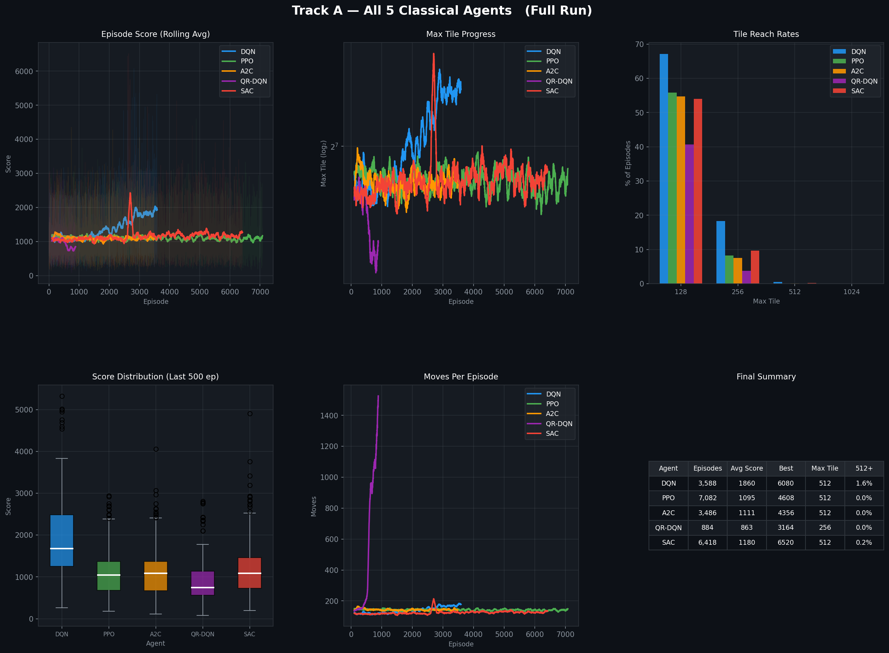
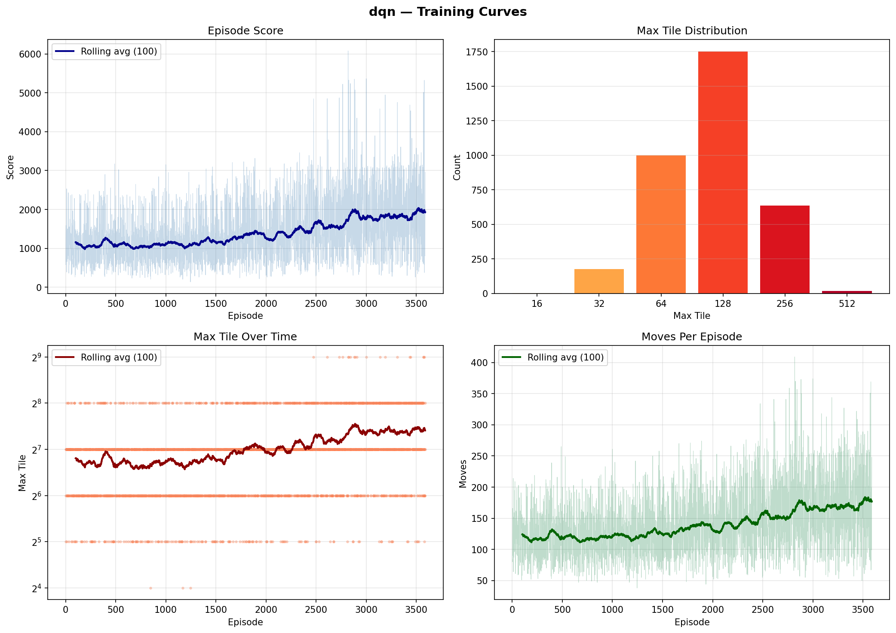
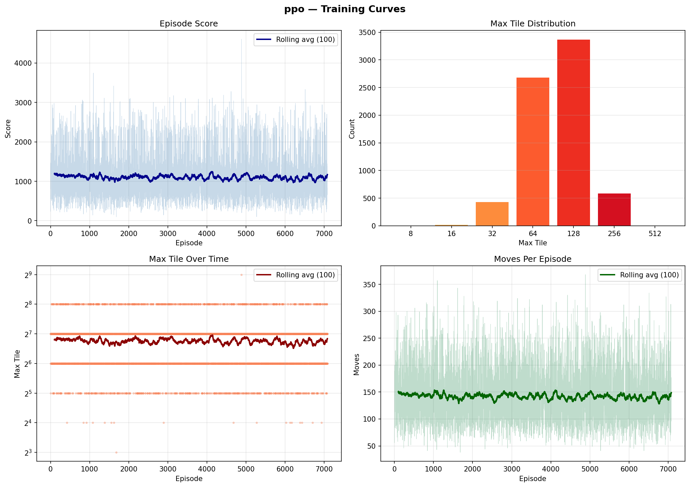
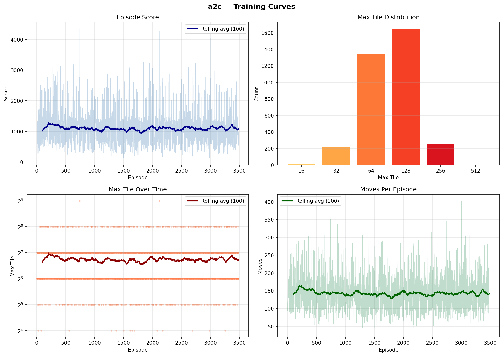
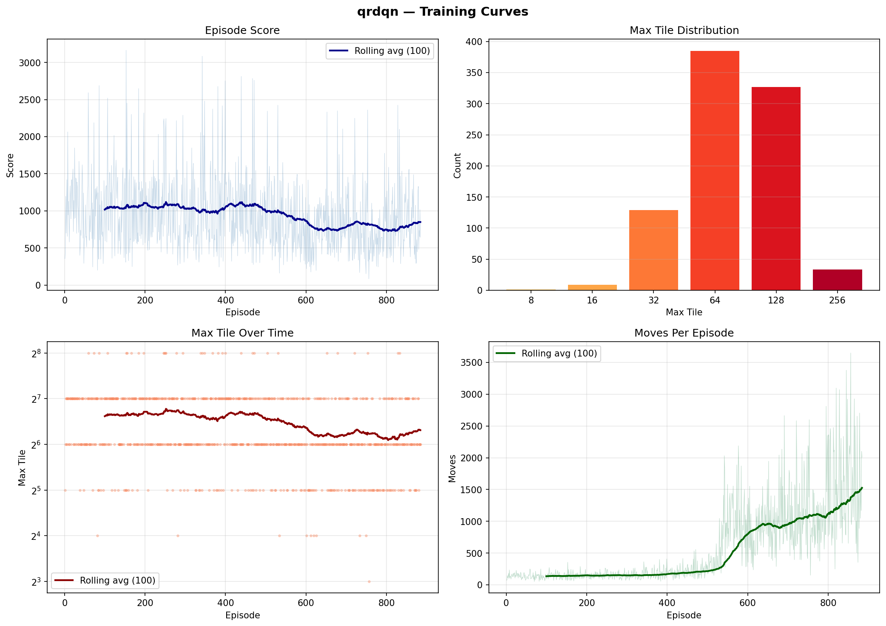
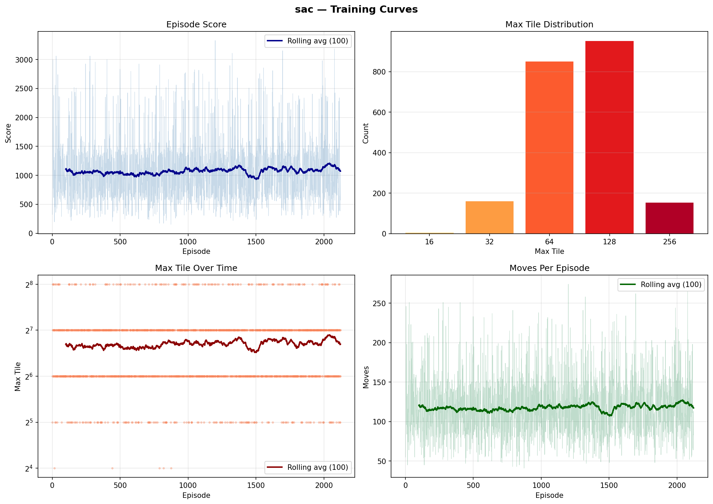

# Solving 2048: Classical RL vs. LLM-Guided RLVR

> **CS 5180 — Reinforcement Learning** | Shriman + Partner

A comparative study of classical Reinforcement Learning (DQN, QR-DQN, PPO, A2C, SAC) versus LLM-based Reinforcement Learning with Verifiable Rewards (GRPO with Qwen2.5-0.5B) on the puzzle game 2048.

---

## 🏆 Track A Results — Classical RL

> Training run: 2026-03-24 | Hardware: NVIDIA RTX 4060 (6GB VRAM)



### Final Performance (500k–1M steps each)

| Agent | Episodes | Best Score | Max Tile | 512+ Rate |
|-------|----------|------------|----------|-----------|
| **SAC** | 6,418 | **6,520** ⭐ | 512 | — |
| **DQN** | 3,588 | 6,080 | 512 | — |
| PPO (4 envs) | 7,082 | 4,608 | 512 | — |
| A2C (8 envs) | 3,486 | 4,356 | 512 | — |
| QR-DQN | 884 | 3,164 | 256 | — |

### Per-Agent Training Curves

<table>
<tr>
  <td><br><b>DQN</b> — 500k steps</td>
  <td><br><b>PPO</b> — 1M steps, 4 parallel envs</td>
</tr>
<tr>
  <td><br><b>A2C</b> — 500k steps, 8 parallel envs</td>
  <td><br><b>QR-DQN</b> — 500k steps</td>
</tr>
<tr>
  <td><br><b>SAC</b> — 500k steps</td>
</tr>
</table>

---

## Project Structure

```
RLVR/
├── src/
│   ├── env/
│   │   ├── game_2048.py        # Core 2048 engine (pure Python/NumPy)
│   │   ├── gym_wrapper.py      # Gymnasium env — 16-channel CNN input, 3 reward modes
│   │   └── text_wrapper.py     # Text/prompt wrapper for LLM + response parser
│   ├── classical/
│   │   ├── dqn_agent.py        # Custom DQN (CNN, replay buffer, target net)
│   │   ├── ppo_agent.py        # SB3 PPO with CnnPolicy + VecEnv parallelization
│   │   ├── a2c_agent.py        # SB3 A2C + VecEnv parallelization
│   │   ├── qrdqn_agent.py      # SB3-contrib QR-DQN
│   │   ├── sac_agent.py        # Discrete SAC (fixed alpha divergence bug)
│   │   └── train.py            # Unified train/eval CLI for all classical agents
│   ├── llm/
│   │   ├── reward.py           # Multi-component verifiable reward functions
│   │   ├── dataset.py          # Board state dataset generator (HuggingFace Dataset)
│   │   ├── train_grpo.py       # GRPO training pipeline (Unsloth + TRL)
│   │   ├── prompt.py           # Prompt templates
│   │   └── predict.py          # LLM inference utilities
│   └── utils/
│       └── metrics.py          # EpisodeMetrics, TrainingLogger, matplotlib plots
├── results/                    # Training curves and comparison plots
├── configs/
│   ├── dqn_config.yaml
│   ├── ppo_config.yaml
│   └── grpo_config.yaml
├── tests/
│   ├── test_env.py             # 52 tests — all passing ✅
│   └── test_reward.py
├── run_all_classical.sh        # One-shot script to train all 5 agents
├── pytest.ini
└── requirements/
    ├── base.txt
    ├── classical.txt
    └── llm.txt
```

---

## Quick Start

```bash
# Setup
python3 -m venv venv && source venv/bin/activate
pip install -r requirements/classical.txt sb3-contrib pytest

# Run tests (52/52 should pass)
python -m pytest tests/ -v

# Train all classical agents sequentially (auto-logs to logs/<agent>/)
bash run_all_classical.sh

# Or train individual agents
python -m src.classical.train train --agent dqn  --steps 500000
python -m src.classical.train train --agent ppo  --steps 1000000 --n-envs 4
python -m src.classical.train train --agent a2c  --steps 500000  --n-envs 8
python -m src.classical.train train --agent qrdqn --steps 500000
python -m src.classical.train train --agent sac  --steps 500000

# Evaluate a trained agent
python -m src.classical.train eval --agent dqn --model logs/dqn/dqn_final.pt --episodes 100

# Train LLM (Track B) — requires GPU
pip install -r requirements/llm.txt
python -m src.llm.train_grpo --config configs/grpo_config.yaml
```

---

## Tracks

| Track | Agent | Method | Framework |
|-------|-------|--------|-----------|
| A | DQN | Custom CNN + Replay Buffer + Target Net | PyTorch |
| A | QR-DQN | Quantile Regression DQN | SB3-contrib |
| A | PPO | CnnPolicy + VecEnv (n_envs=4) | Stable-Baselines3 |
| A | A2C | CnnPolicy + VecEnv (n_envs=8) | Stable-Baselines3 |
| A | SAC | Discrete SAC (Christodoulou 2019) | PyTorch |
| B | LLM | Qwen2.5-0.5B + GRPO + QLoRA 4-bit | Unsloth + TRL |

---

## Environment

The 2048 game environment has two interfaces:

- **Gym wrapper** (`gym_wrapper.py`): Standard Gymnasium env for classical RL. Observations are 16-channel binary tensors — channel 0 encodes empty cells, channels 1–15 encode tile values 2¹–2¹⁵. Supports three reward modes:
  - `score_delta` — raw merge score per step
  - `log_score` — log2-scaled score delta
  - `shaped` — score_delta + monotonicity bonus

- **Text wrapper** (`text_wrapper.py`): Converts board states to structured text prompts for the LLM. Parses model outputs in the format:
  ```
  <think>
  [reasoning about the board]
  </think>
  <answer>UP|DOWN|LEFT|RIGHT</answer>
  ```

---

## Parallelization

For Track A, PPO and A2C support parallelized environment collection via SB3's `make_vec_env`:

```bash
# PPO with 4 parallel environments
python -m src.classical.train train --agent ppo --steps 1000000 --n-envs 4

# A2C with 8 parallel environments (benefits most — short n_steps=5 rollouts)
python -m src.classical.train train --agent a2c --steps 500000 --n-envs 8
```

> **Note on Genesis:** Genesis is a GPU-accelerated physics/robotics simulator — not applicable to 2048 (a discrete grid game). SB3's `VecEnv` is the equivalent parallelization mechanism for this project.

---

## LLM Track — GRPO Training

The LLM track fine-tunes **Qwen2.5-0.5B-Instruct** using GRPO (Group Relative Policy Optimization) with QLoRA 4-bit via Unsloth. Five reward functions are passed separately to `GRPOTrainer`:

| Function | Weight | Signal |
|----------|--------|--------|
| `format_reward_fn` | 0.3 | Valid `<think>` + `<answer>` XML |
| `direction_reward_fn` | 0.3 | Valid direction ∈ {UP, DOWN, LEFT, RIGHT} |
| `game_reward_fn` | 0.2 | +1.0 valid move, score_delta/1024, −2.0 no-op |
| `thinking_quality_reward_fn` | 0.1 | Strategic vocabulary, tile mentions |
| `length_reward_fn` | 0.1 | Anti-degenerate-completion signal |

---

## Hardware

- **GPU**: NVIDIA RTX 4060 (6GB VRAM)
- **GRPO VRAM**: ~3–4GB (0.5B model, QLoRA 4-bit, G=8)
- **Classical RL speed**: ~150–750 steps/sec (agent-dependent)

---

## References

1. Guo et al. (2025). DeepSeek-R1: Incentivizing Reasoning via RL.
2. Wen et al. (2025). RLVR Implicitly Incentivizes Correct Reasoning in Base LLMs.
3. Saligram et al. (2025). 2048: RL in a Delayed Reward Environment (arXiv:2507.05465).
4. Hu et al. (2025). lmgame-Bench: How Good are LLMs at Playing Games?
5. Christodoulou (2019). Soft Actor-Critic for Discrete Action Settings.
